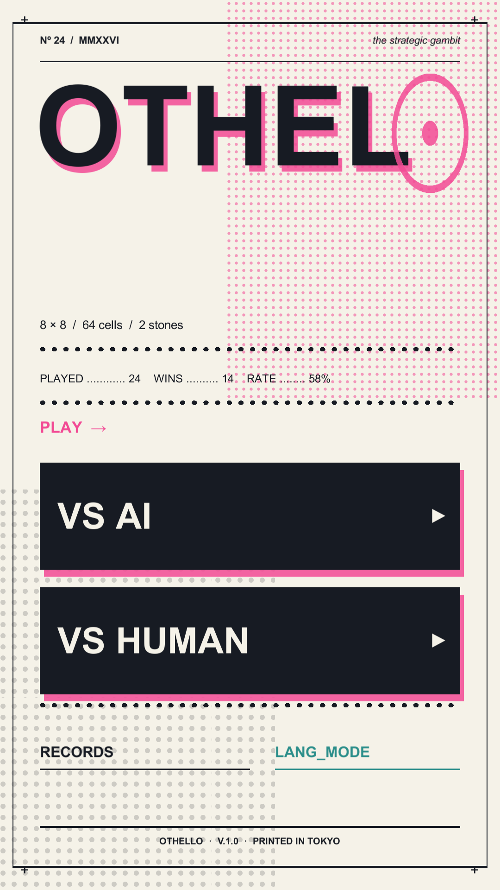
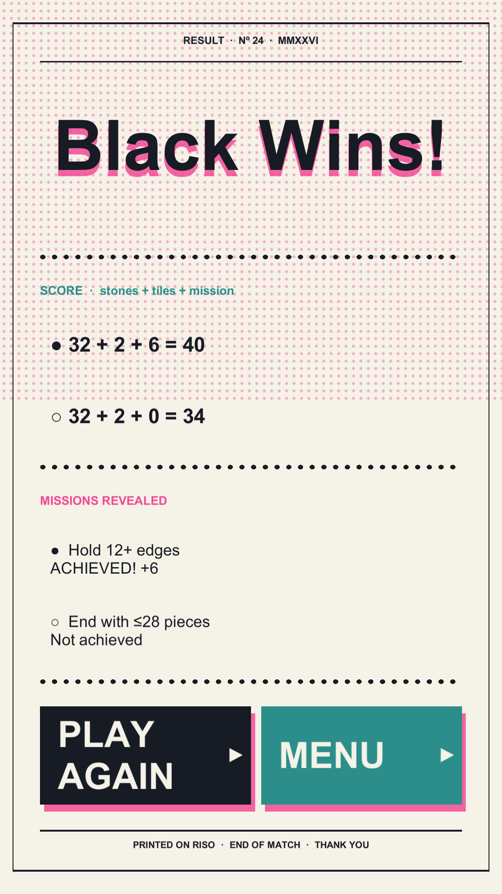
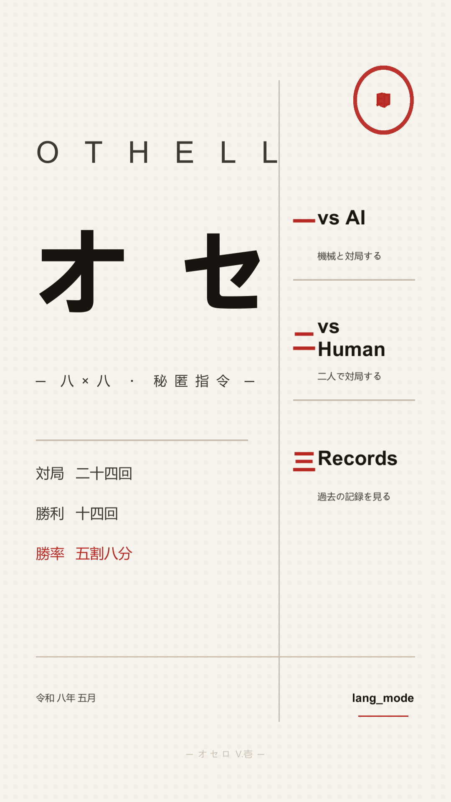
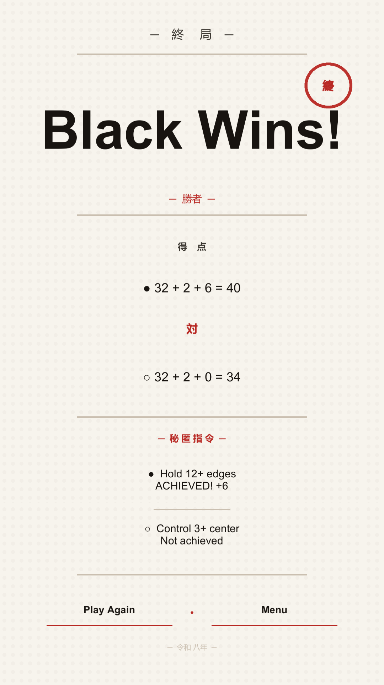
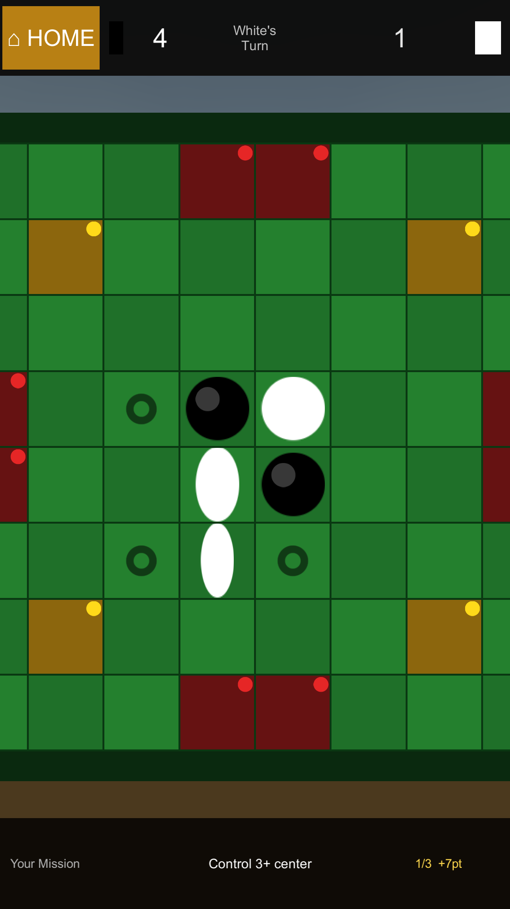
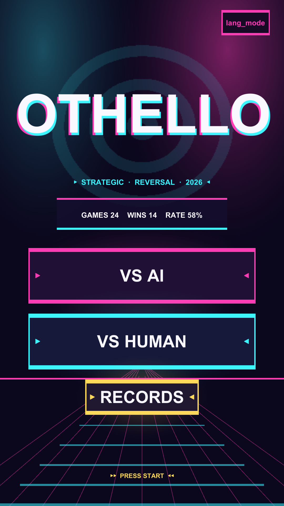
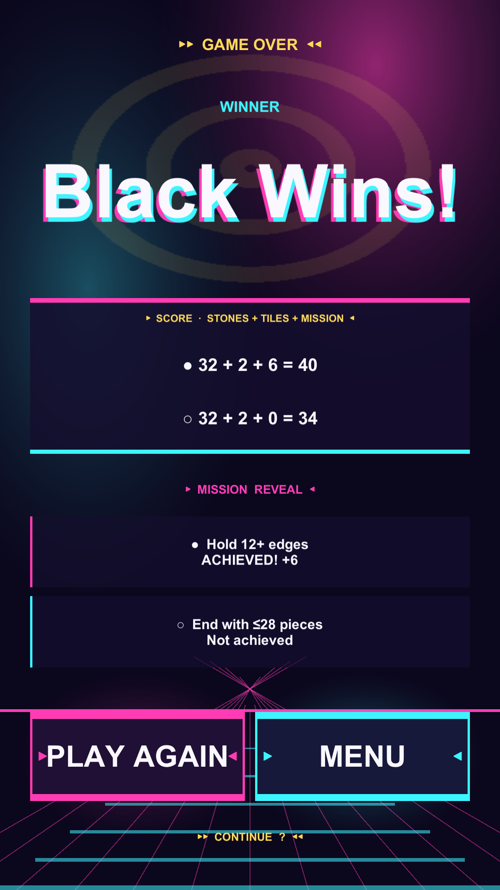
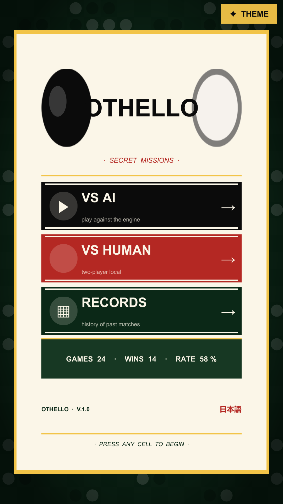
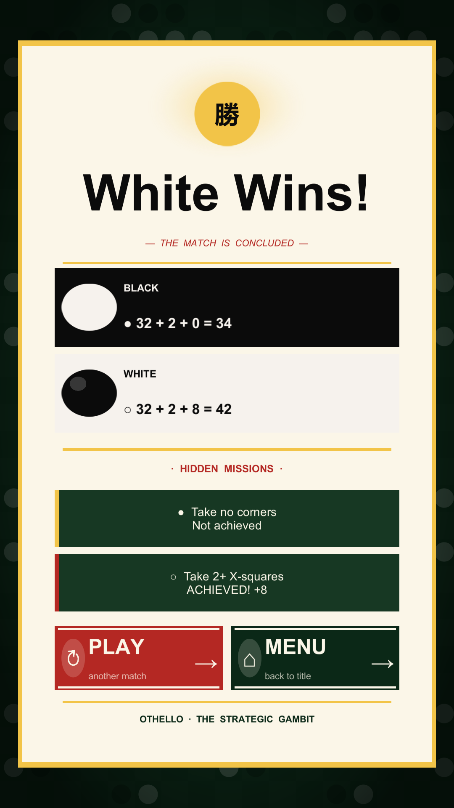

# Othello — UI Design Direction Comparison

4 抜本的に異なる視覚言語。**実 Unity ビルド + PlayMode テストでレンダリングした本物のスクリーンショット**。手続き的に生成した装飾スプライト (ハーフトーン点・グリッド・グロー・盤面パターン・印鑑) を使用、ただの色付き矩形ではない。

| Theme | 視覚言語 | 装飾モチーフ |
|---|---|---|
| **Riso** | 2 色刷リソグラフ印刷ジン | ハーフトーン点群 / ピンク見当ズレ / ドットルール / 折版マーク |
| **Wabi** | 和の minimalism | 朱印 / 縦組 / 漢字 / 黄金分割の縦線 / 余白 |
| **Neon** | synthwave / アーケード | 放射グロー / 透視地平線 / 同心円 / 色分散タイトル |
| **Pieces** | 盤面モチーフ前面 | 駒パターン背景 / 黒白駒装飾 / 金縁額 / 緑フェルト |

切替は `Assets/Scripts/UI/OthelloTheme.cs` の `Active` を 1 行変えるだけ。

---

## A. Riso

### Title


### Game Over


### In-game (1手後)


---

## B. Wabi (和)

### Title


### Game Over


### In-game (1手後)


---

## C. Neon

### Title


### Game Over


### In-game (1手後)


---

## D. Pieces

### Title


### Game Over


### In-game (1手後)


---

## 全 10 スクショへのリンク

各テーマに 10 枚 (Title / In-game 各種 / GameOver / Pass / その他):

- [Riso (10 PNG)](screenshots/Riso/)
- [Wabi (10 PNG)](screenshots/Wabi/)
- [Neon (10 PNG)](screenshots/Neon/)
- [Pieces (10 PNG)](screenshots/Pieces/)

## 採用方法

[Assets/Scripts/UI/OthelloTheme.cs](../../Assets/Scripts/UI/OthelloTheme.cs):
```csharp
public static ThemeKind Active { get; private set; } = ThemeKind.Pieces;  // ← 採用名
```
