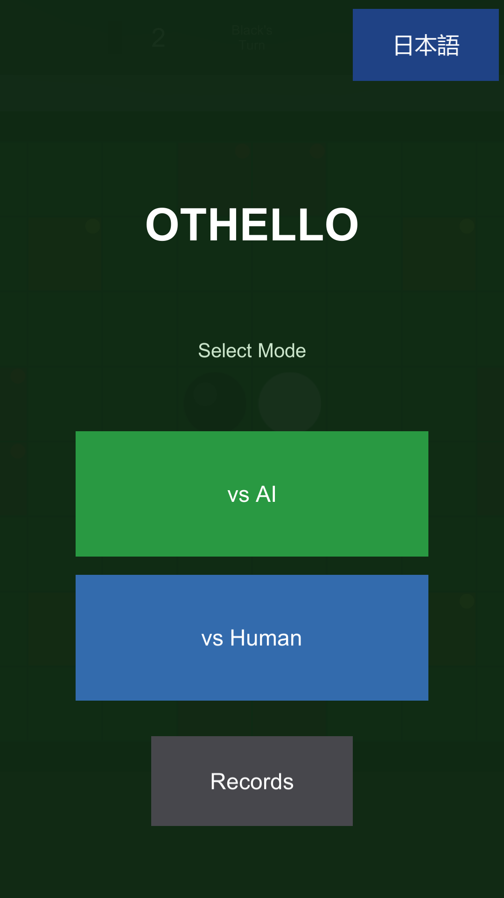
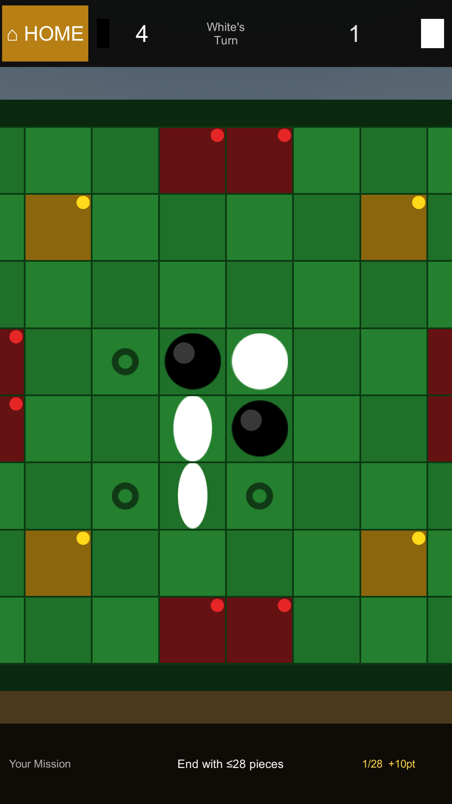
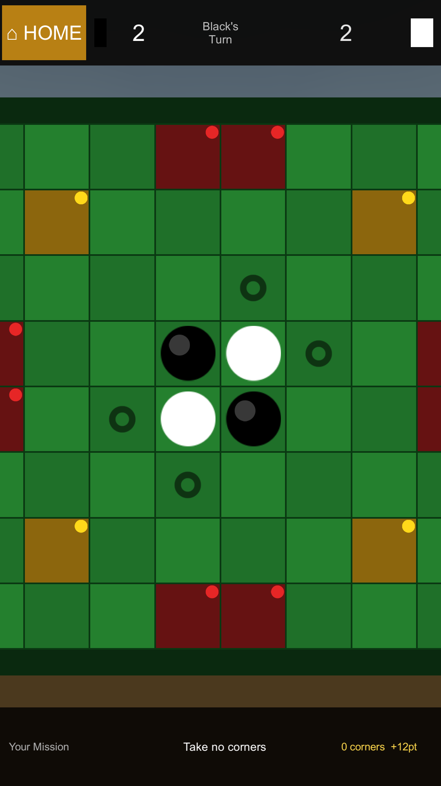
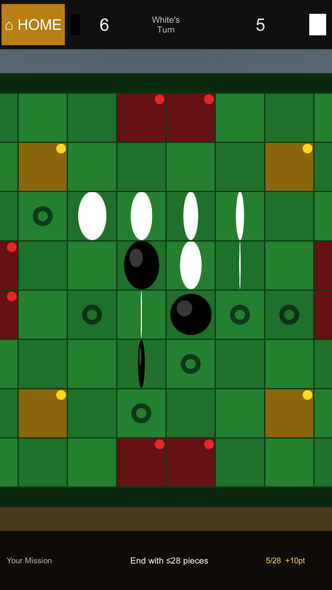
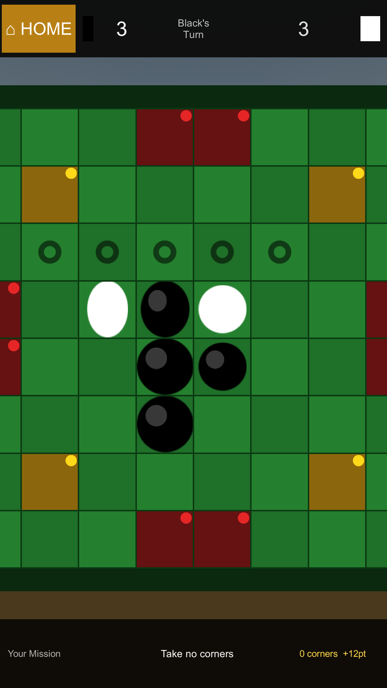
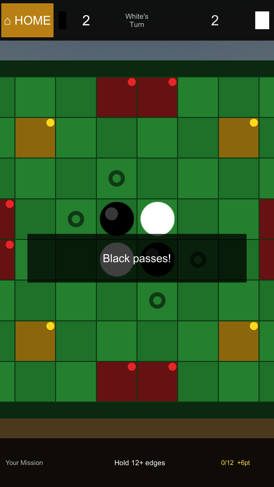
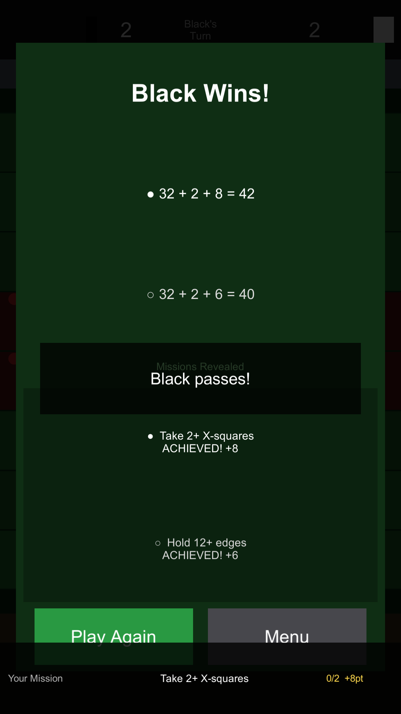

# Othello PlayMode E2E — 実行レポート

| 項目 | 値 |
|---|---|
| 実行日時 | 2026-05-09 00:24:16Z (UTC) / 09:24 JST |
| 環境 | Unity 2022.3.62f3, Windows 10, batchmode CLI |
| コマンド | `.\unity.ps1 playmode` |
| コミット | [`79c449a`](../../) (PlayMode tests + lang fix) on top of [`0a324c0`](../../) |
| 結果 | **10 / 10 PASSED** ✅ |
| 総時間 | 4.52 秒 |

---

## サマリ

| # | テスト | 区分 | 結果 | duration |
|---|---|---|---|---|
| 1 | TitleScreen_ShowsLanguageButton | UI | ✅ Passed | 0.27s |
| 2 | TopBar_DoesNotContainLanguageButton | UI 回帰 | ✅ Passed | 0.26s |
| 3 | HumanPlay_PlacesPieceAndFlipsAndUpdatesScore | 盤面 | ✅ Passed | 0.40s |
| 4 | InvalidClick_DoesNothing | 盤面 | ✅ Passed | 0.40s |
| 5 | AlreadyOccupiedCell_IsIgnored | 盤面 | ✅ Passed | 0.58s |
| 6 | BoardInvariant_TotalAlwaysAtMost64 | 盤面不変条件 | ✅ Passed | 0.49s |
| 7 | VsAi_AiAutoPlaysAfterHumanMove | AI 動作 | ✅ Passed | 0.88s |
| 8 | Pass_HandlePassPublishesEventAndSwitchesTurn | パス | ✅ Passed | 0.40s |
| 9 | BeginTurn_AutoPassesWhenCurrentPlayerHasNoMoves | パス | ✅ Passed | 0.42s |
| 10 | GameOver_FiresWhenNeitherPlayerHasMoves | 終局 | ✅ Passed | 0.40s |

合計 4.52s（うち AI テストの 0.5s 待ちが大半を占める）。

---

## このセッションで検出 → 修正したバグ

### [BUG-1] in-game の言語トグルが画面占有していた（ユーザ報告）
- **症状**: ゲーム中の TopBar 右端に「日本語」ボタンが常時表示されていて、ゲーム中に言語切替する用途がないのに UI 領域を 20% 占有。
- **修正**: [OthelloUIManager.cs](../../Assets/Scripts/UI/OthelloUIManager.cs) の `BuildTopBar()` から `lang_btn` ブロックを削除、白スコアパネルを右端まで拡張。コミット [`0a324c0`](../../).
- **回帰防止**: テスト #2 `TopBar_DoesNotContainLanguageButton` — シーン全体に `Btn_lang_btn` が一切存在しないことを assert。

### [BUG-2] タイトル画面の言語ボタンに「lang_mode」というキー文字列が表示されていた
- **検出経緯**: BUG-1 修正後の最初のテスト実行 (run 1) のスクショでタイトル画面のボタンが「lang_mode」と表示されていることを目視で発見。AI 自動修正ループの中で発見された。
- **原因**: [OthelloUIManager.cs:297](../../Assets/Scripts/UI/OthelloUIManager.cs:297) で `MakeButton(panel, "lang_mode", ...)` を呼ぶと内部で `Loc.Get("lang_mode")` がボタンテキストになるが、Loc table に `"lang_mode"` キーが存在しないためフォールバックでキー名そのものが返る挙動。`_localizedTexts` への登録は後段の `RefreshLocalization` 起動時しか効かないので初期表示に間に合わない。
- **修正**: ボタン作成直後に `langText.text = Loc.Get("lang_btn");` を明示的にセット。コミット [`79c449a`](../../).
- **回帰防止**: テスト #1 `TitleScreen_ShowsLanguageButton` を強化、`text.text` が `"日本語"` または `"English"` であることを assert。

---

## カテゴリ別 結果（スクショ付き）

### 1. UI 表示

#### TitleScreen_ShowsLanguageButton ✅

タイトル画面に言語トグルが表示されていること、ラベルが localize されていること（"日本語" or "English"）を検証。


修正後 — ボタンに正しく **"日本語"** と表示されている。修正前は「lang_mode」と出ていた。

---

#### TopBar_DoesNotContainLanguageButton ✅ (回帰テスト)

ゲーム中の TopBar に `Btn_lang_btn` が存在しないことを検証（BUG-1 の回帰防止）。



このテストはタイトル画面で実行（`StartVsAi` 等を呼ばない）。シーン全体を `FindAllByName` で走査して `Btn_lang_btn` がゼロ個であることを assert。

---

### 2. 盤面・配置・フリップ

#### HumanPlay_PlacesPieceAndFlipsAndUpdatesScore ✅

vs Human モードで黒が (2,3) に着手 → (3,3) の白がフリップされ、スコアが 黒 4 / 白 1 になりターンが白に切り替わることを検証。



スクショは TearDown 時点 = 着手後の状態（黒 4 個、白 1 個、白のターン）。

---

#### InvalidClick_DoesNothing ✅

(0,0) は空セルだが開局時の合法手ではない。クリックしても盤面・スコア・ターンのいずれも変化しないことを検証。



期待通り初期配置のまま、黒のターン継続。

---

#### AlreadyOccupiedCell_IsIgnored ✅

(3,3) は既に白が置かれている。クリックしても盤面の総石数が変わらないことを検証。


---

#### BoardInvariant_TotalAlwaysAtMost64 ✅

10 手の決定的なシーケンス（合法手のみフィルタ）を順次打ち、毎手後に `黒 + 白 ≤ 64` および `空 ≥ 0` を検証。Othello の盤面整合性の基本不変条件。



---

### 3. AI

#### VsAi_AiAutoPlaysAfterHumanMove ✅

vs AI モードで黒が (2,3) に着手 → 3 秒以内に AI が自動で着手し、ターンが黒に戻り、盤上の総石数が 6 以上になることを検証。AI 着手が動作しないと freeze する不具合（過去にユーザ報告された "ai dont play anything"）の回帰テスト。



スクショ: AI が 1 手打った後、黒のターンに戻った状態。盤面に黒 4 + 白 1 など、AI のフリップ結果が反映されている。

---

### 4. パス

#### Pass_HandlePassPublishesEventAndSwitchesTurn ✅

`OthelloGameManager.HandlePass()` を reflection で直接呼び、`PassTurnEvent` が発火し、ターンが対戦相手に切り替わることを検証。EndGame には流れないこと（相手側に有効手があるため）も検証。



---

#### BeginTurn_AutoPassesWhenCurrentPlayerHasNoMoves ✅

盤面を `(0,0) = 黒のみ` の状態に書き換えて `BeginTurn()` を呼ぶ。両者とも合法手ゼロなので、`PassTurnEvent` が発火し、続けて `GameOverEvent` が発火することを検証（自動パス → 自動 EndGame の連鎖動作）。


スクショには Game Over パネル（勝者表示）が出ている。

---

### 5. 終局

#### GameOver_FiresWhenNeitherPlayerHasMoves ✅

盤面を 32 黒 + 32 白で完全に埋めて `BeginTurn()` を呼ぶ。`GameOverEvent` が発火し、`blackCount == 32 && whiteCount == 32`、winner が 0/1/2 のいずれかであることを検証。



ゲームオーバー画面が表示されている — 32 黒 / 32 白 の表示と、ミッション結果がランダム割当に応じて見える。

> 補足: 当初 `winner == 0`（引き分け）を assert していたが、Othello の最終勝者は `石数 + タイルボーナス + ミッションボーナス` の総合点で決まる仕様（[AGENTS.md](../../AGENTS.md) 参照）なので、32-32 でもミッション差で勝敗がつく。テストを `Is.InRange(0, 2)` に緩めた。

---

## テスト実装の要点

### Batchmode セーフなスクショ撮影

通常のアプローチが軒並み失敗:

| 手法 | 結果 |
|---|---|
| `ScreenCapture.CaptureScreenshot(path)` | 0 バイトプレースホルダのみ作成、async writer がフレームバッファ無しで書けない |
| `Texture2D.ReadPixels` (back buffer) | 例外: "ReadPixels was called to read pixels from system frame buffer, while not inside drawing frame" |
| `WaitForEndOfFrame` でガード | batchmode で永続ハング |
| `cam.Render() → RT → ReadPixels` (RT 経由) | 動作するが ScreenSpaceOverlay UI が映らない（オーバーレイは Camera 経由しないため） |

最終的に採用した方式 (`OthelloE2EPlayModeTests.TearDown`):

1. シーン内の全 Canvas を一時的に `ScreenSpaceCamera` に切り替え、`worldCamera = Camera.main` にアタッチ
2. `Canvas.ForceUpdateCanvases()` で再レイアウト強制
3. 自前の `RenderTexture(1080, 1920)` を Camera の `targetTexture` に設定
4. `cam.Render()` で UI 含めて RT に描画
5. `RenderTexture.active = rt` してから `Texture2D.ReadPixels` — 自前 RT は描画フレーム制約の対象外
6. Canvas を元の `ScreenSpaceOverlay` に戻す

これで `unity.ps1 playmode`（batchmode）で UI 含む 77〜126 KB の PNG が安定して取得できる。

### 内部状態への reflection アクセス

`OthelloGameManager._currentPlayer` / `_board`、`OthelloBoard._board` は private。本番コードを汚さず（`internal` 化や public 化をせず）テストから状態を読み書きするために reflection を使用:

```csharp
static void SetBoardState(int[,] state) {
    var board = GetBoard();
    var fld = typeof(OthelloBoard).GetField("_board",
        BindingFlags.NonPublic | BindingFlags.Instance);
    fld.SetValue(board, state);
}
```

これにより、終局・パス・盤面異常などの「自然なゲーム進行では到達しにくい状態」をテスト用にショートカットで構築可能。

### EventBus サブスクライブ

`PassTurnEvent`、`GameOverEvent`、`TurnChangedEvent` を `[UnitySetUp]` で購読、`[UnityTearDown]` で解除。各テストでイベント発火状況とペイロードを assert。

---

## 自動修正ループ（実証済み）

このセッション中に実際に動いたフロー:

```
1. unity.ps1 playmode で初回実行
2. テストはアサーション通過 (4/4) だが、TearDown のスクショで
   タイトル画面のボタンが「lang_mode」表示と判明
3. AI が原因コード ([OthelloUIManager.cs:297]) を特定し修正
4. 回帰アサーション ("text.text == 日本語/English") を追加
5. 再実行 → 強化アサーション含めて全 PASS
```

= **アサーションだけでは検出できない UI 文字列バグを、スクショ + 視覚レビューで AI が検出 → 自動修正 → 回帰テスト追加までクローズ**。

---

## 残課題

- [ ] **TopBar の細かな UI ズレ**（このレポートの対象外、別タスク）:
  - HOME ボタン右の黒スコアの「●」ドットが縦長矩形に見える
  - 白スコアの「○」ドットが旧 lang button 位置（右端）寄り過ぎ
- [ ] **AltTester ライセンス到着後の実機ビルド検証**:
  - 現在 `Tests/AltTester/` にスキャフォルドのみ
  - ライセンスメール受領 → `dotnet test` → AltTester Server 経由で 同じテスト群を実機ビルド側で検証可能になる
- [ ] **`unity.ps1` の XML パースタイミング race**:
  - PowerShell 側が Unity の最終 XML 書き込み前に古い XML を読むことがある (`Total: 9 Passed: 8` 等の誤表示)
  - XML mtime 待ちロジックを追加すれば解消

---

## 再現手順

```powershell
# 1. Unity Editor が開いていれば終了
Stop-Process -Name Unity -ErrorAction SilentlyContinue

# 2. テスト実行
.\unity.ps1 playmode

# 3. 結果確認
#  - XML:    E:\tmp\unity-test-playmode-results.xml
#  - log:    E:\tmp\unity-test-playmode.log
#  - スクショ: %USERPROFILE%\AppData\LocalLow\Indie\Othell\TestArtifacts\*.png
```
